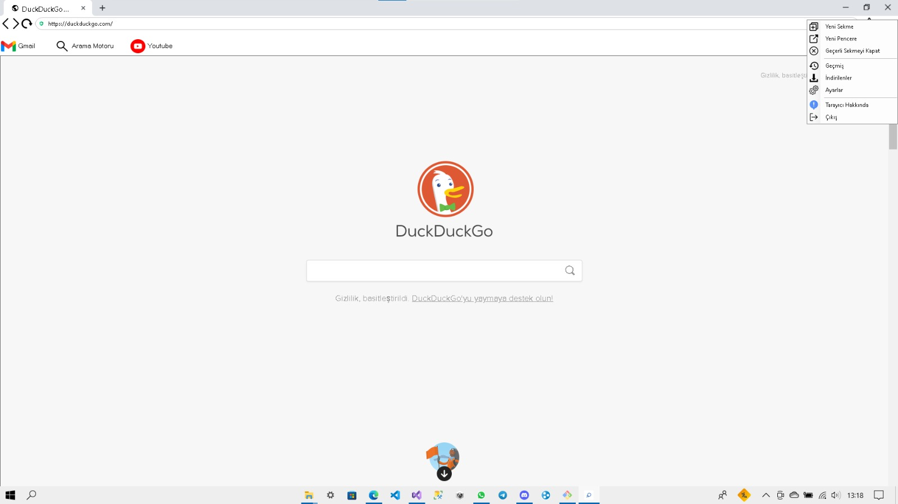

# Webenion: Web Browser
Webenion benim sıfırdan kodlamış olduğum bir web tarayıcısıdır. Tamamen C# ile kodlanmış ve içinde Bunifu.UI.WinForms, CefSharp, MaterialSkin ve EasyTabs 
kütüphanelerini kullandım. Toplam 7 formdan oluşan içinde main page, history, dowloads, favori ekleme sayfası, -indirmek istediğinize emin misiniz- sayfası,
ayarlar sayfası ve EasyTabs görünümünün olması için bir appcontainer formu var. Bu 7 formun dışında sıkıntısız çalışan ve birden fazla tarayıcı seçme, 
varsayılan email değiştirme gibi birkaç özelliği de içinde bulunduran bir web browserdır. İçindeki gereksiz dosyaları silip temizledim umarım işinize
yarayan bir proje olmuştur. 
#
### Not
Proje daha bitmemiştir hale geliştirme aşamasındadır.

# Eklenti Görselleri

